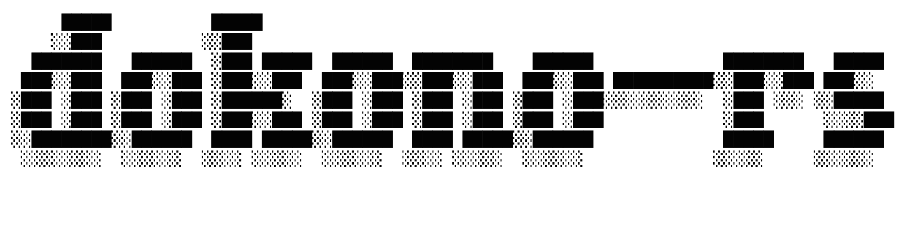

<p align="center">
  
</p>

# dokono-rs

[](#license)
[](https://crates.io/crates/dokono-rs)

A CLI tool that detects **which binary entrypoints are affected by a code change** in a Rust workspace, without running a build. It uses [rust-analyzer](https://rust-analyzer.github.io/) over LSP as a static-analysis backend.

`dokono-rs` never invokes `cargo build` or `--emit=dep-info`. It traces a symbol-level reference graph instead, so even on dependency-heavy workspaces the result usually comes back in tens of seconds.

> The name comes from the Japanese word *dokono* (どこの), meaning "of which / from where" — answering the question "which binary is affected?".

---

Contents:

- [Motivation](#motivation)
- [How it works](#how-it-works)
- [Installation](#installation)
- [Usage](#usage)
  - [Inspect the impact of a PR](#inspect-the-impact-of-a-pr)
  - [Compare two arbitrary git refs](#compare-two-arbitrary-git-refs)
  - [Output](#output)
  - [Diagnostic mode (`debug` subcommand)](#diagnostic-mode-debug-subcommand)
- [Supported project layouts](#supported-project-layouts)
- [Requirements](#requirements)
- [Known limitations](#known-limitations)
- [Troubleshooting](#troubleshooting)
- [License](#license)

## Motivation

In a clean-architecture Rust workspace, multiple binary entrypoints often share common layers (`domain` / `usecase` / `infrastructure`, etc.). When a shared layer changes, **which binaries are actually affected** is not obvious at a glance.

Cargo's dependency graph only resolves at the **crate level**. If multiple entrypoints live inside the same `bin` crate (for example, `services/src/bin/{api,worker,migrate}.rs`), Cargo cannot tell whether a single function change in `domain/` or `usecase/` affects only `api.rs`, or whether `worker.rs` is dragged in too.

`dokono-rs` solves this by walking the reference graph at the **symbol level** through rust-analyzer's LSP interface.

## How it works

```
git diff <base> <head>
       │
       ▼
changed files + changed line numbers
       │
       ▼  textDocument/documentSymbol
innermost symbol enclosing each changed line
       │
       ▼  BFS (textDocument/references + textDocument/declaration)
       │   - declaration: normalize impl method → trait method
       │   - references: walk to call sites
       │   - re-run documentSymbol at each reference site to find
       │     the enclosing function
       ▼
match against bin paths from cargo metadata → affected entrypoints
```

Key points:

- `textDocument/references` returns "references to the symbol at a given position." On every BFS step we re-query `documentSymbol` to convert **"reference site → declaration position of the enclosing function"**, which is what lets us walk *upward* through call chains.
- Trait dispatch through `Arc<dyn Trait>` is captured by sending `textDocument/declaration` first to normalize **impl method → trait method declaration**.
- A `visited` set keeps the BFS terminating in the presence of cycles.
- Readiness is detected deterministically by waiting for an `experimental/serverStatus` notification with `quiescent: true`. There are no fixed sleeps or bounded retry counts.

## Installation

From crates.io:

```bash
cargo install dokono-rs
```

Or build from source:

```bash
git clone https://github.com/enomoto11/dokono-rs
cd dokono-rs
cargo build --release
# binary is produced at ./target/release/dokono
```

`rust-analyzer` must be available on `$PATH`:

```bash
rustup component add rust-analyzer
```

## Usage

### Inspect the impact of a PR

Pass a GitHub PR number and `dokono-rs` will fetch the head from `origin`, compute the merge-base against `--base`, and run the analysis.

```bash
# Impact of PR #1062 against the master branch
dokono --workspace /path/to/your-workspace --pr 1062

# Compare against a release branch instead
dokono --workspace /path/to/your-workspace --pr 1062 --base release
```

`--base` defaults to `master`.

Internally this runs:

```bash
git fetch origin pull/<N>/head:dokono-pr-<N>
git merge-base <base> dokono-pr-<N>
# diff is taken between that merge-base and dokono-pr-<N>
```

**Assumptions for `--pr`:**

- The target workspace's `origin` remote points at the GitHub repository that owns the PR. The repo identity is taken entirely from `origin`; nothing is hardcoded inside `dokono-rs`, so any GitHub repository works as long as `origin` is configured correctly.
- The remote uses GitHub's `pull/<N>/head` ref convention. GitLab merge requests, Bitbucket pull requests, and other forges are **not** supported by `--pr`.
- The remote name is `origin`. Other remote names (`upstream`, etc.) are not supported.

If any of those assumptions do not hold (a non-GitHub forge, a non-`origin` remote, or a private mirror), use [`--head/--base`](#compare-two-arbitrary-git-refs) instead and fetch the ref yourself first:

```bash
git fetch upstream pull/123/head:my-pr
dokono --workspace . --base $(git merge-base master my-pr) --head my-pr
```

### Compare two arbitrary git refs

Without `--pr`, you can compare any two git refs directly:

```bash
# Base branch vs current HEAD
dokono --workspace /path/to/your-workspace --base master --head HEAD

# Two specific commits
dokono --workspace /path/to/your-workspace --base abc123 --head def456

# Your feature branch vs master
dokono --workspace /path/to/your-workspace --head my-feature-branch
# (--base defaults to master)
```

`--head` and `--pr` are mutually exclusive — pass exactly one.

### Output

Two output formats are supported, selected with `--format` (default: `text`).

#### `--format text` (human-friendly)

Result on **stdout**:

```
Affected entrypoints:
  services/src/bin/api.rs
  services/src/bin/worker.rs
```

- Paths are relative to the workspace root.
- Order is deterministic (sorted via `BTreeSet`).
- When nothing is affected: `Affected entrypoints: none`.

Progress on **stderr** adapts to whether stderr is a TTY:

- **TTY (interactive)**: an animated spinner with phase messages (`indexing workspace ...`, `tracing references (BFS) ...`, etc.). The spinner is cleared before the final stdout print.
- **Non-TTY (piped, redirected, CI logs)**: one plain log line per phase, suitable for `tee` / `grep`.

Either way, **stdout never contains progress noise**, so parsing stdout is safe.

#### `--format json` (CI / scripting)

A single JSON object on **stdout**, completely silent on **stderr** (apart from hard errors via `anyhow`). Suitable for piping into `jq`:

```bash
dokono --workspace . --pr 1062 --format json
```

```json
{
  "schema_version": 1,
  "pr": 1062,
  "base": "abc123def456...",
  "head": "dokono-pr-1062",
  "status": "ok",
  "affected": [
    "services/src/bin/api.rs",
    "services/src/bin/worker.rs"
  ]
}
```

| Field | Type | Notes |
|---|---|---|
| `schema_version` | int | currently `1`. Bumped on incompatible schema changes. |
| `pr` | int \| null | PR number when invoked with `--pr`, otherwise `null`. |
| `base` / `head` | string | git refs as resolved by `dokono-rs` (in `--pr` mode `base` is the merge-base SHA and `head` is the local fetched ref). |
| `status` | enum | `ok` \| `no_rs_changes` \| `no_symbol_changes` |
| `affected` | string[] | workspace-relative paths, sorted. Empty unless `status == "ok"`. |

Example CI snippet:

```bash
# Fail the job iff a specific bin is impacted
affected=$(dokono --workspace . --pr "$PR" --format json | jq -r '.affected[]')
echo "$affected" | grep -q '^services/src/bin/api\.rs$' && exit 1 || exit 0
```

Exit code is `0` on success (including an empty `affected` list), non-zero on error.

### Diagnostic mode (`debug` subcommand)

For inspecting individual pipeline stages, use the `debug` subcommand:

```bash
# Just the parsed git diff
dokono debug print-diff --workspace /path/to/your-workspace --base origin/master~5 --head origin/master

# Bin entrypoints discovered via cargo metadata
dokono debug print-entrypoints --workspace /path/to/your-workspace

# Run only the rust-analyzer spawn + indexing + shutdown cycle (useful for timing)
dokono debug index --workspace /path/to/your-workspace

# documentSymbol tree for a specific file
dokono debug symbols --workspace /path/to/your-workspace \
    --file domain/src/model/foo.rs

# Symbol picked at a specific line (--line is 1-based)
dokono debug symbols --workspace /path/to/your-workspace \
    --file domain/src/model/foo.rs --line 17

# References at a specific position (--line / --char are 0-based, matching documentSymbol output)
dokono debug references --workspace /path/to/your-workspace \
    --file domain/src/model/foo.rs --line 12 --char 11
```

Logging is powered by the [`tracing`](https://crates.io/crates/tracing) crate and controlled via the standard `RUST_LOG` environment variable (default: `warn`). This works in both the main pipeline and the debug subcommands:

```bash
# Show BFS traversal and other debug-level details
RUST_LOG=dokono=debug dokono --workspace /path/to/your-workspace --pr 1062

# Show everything including rust-analyzer's stderr
RUST_LOG=trace dokono --workspace /path/to/your-workspace --pr 1062

# Suppress all log output (e.g. for CI)
RUST_LOG=off dokono --workspace /path/to/your-workspace --pr 1062
```

> rust-analyzer indexes the entire workspace on startup. Depending on project size, this can take tens of seconds to a few minutes (10–20 seconds with a warm cache on a sizeable workspace). This is an intentional trade-off: `dokono-rs` favors **correct detection** over raw speed.

## Supported project layouts

Binary entrypoint paths come from `cargo metadata`, so any layout declared in `Cargo.toml` works:

```
src/main.rs              # single binary (binary name = package name)
src/bin/a.rs             # multiple binaries (auto-detected)
src/bin/b.rs
src/bin/server/main.rs   # multi-file binary
crates/foo/src/main.rs   # bin under a workspace member
```

Custom paths declared via `[[bin]]` in `Cargo.toml` are honored — `src/bin/` is never hardcoded — so layouts like `services/src/bin/*.rs` are picked up automatically.

## Requirements

| | |
|---|---|
| Rust toolchain | stable (required to build) |
| rust-analyzer | must be on `$PATH` (install with `rustup component add rust-analyzer`) |
| Git | any version |
| Target workspace | `cargo metadata` must succeed (i.e., a valid `Cargo.toml`). The code does not need to compile, but proc-macro and other dependencies must resolve. |

## Known limitations

- **Macro expansion**: heavy proc-macro / declarative-macro usage can leave rust-analyzer's reference resolution incomplete in some spots.
- **External crates**: rust-analyzer's `SearchScope` is limited to the local workspace. Code under `~/.cargo/registry` is not traversed.
- **Generic / inference-dependent code**: rust-analyzer may not return references where it cannot infer a type.
- **Downward traversal of trait impls**: `dokono-rs` walks *upward* (caller-side) from a trait method, but it does not enumerate **all impls** of a trait to expand the impact set. This is intentional — it avoids unbounded fan-out (`textDocument/implementation` is deliberately not used).

## Troubleshooting

### Empty result (`Affected entrypoints: none`)

Possible causes:
1. The changed lines fall outside any symbol (comments, `use` statements, blank lines) — BFS has no starting point.
2. The PR fetch failed — look for `git fetch origin pull/<N>/head:...` errors above.
3. rust-analyzer indexing was incomplete — set `RUST_LOG=dokono=debug` and check that `experimental/serverStatus quiescent=Some(true)` is observed.

### `Unknown binary 'rust-analyzer' in official toolchain '...'`

This happens when the target workspace's `rust-toolchain.toml` pins a toolchain that does not include rust-analyzer. `dokono-rs` is designed to **avoid changing the child process's cwd to the target workspace** to sidestep this, but if it still appears:

```bash
rustup component add rust-analyzer --toolchain <the project's toolchain>
```

Or override the toolchain for one invocation:

```bash
RUSTUP_TOOLCHAIN=stable dokono --pr 1062 ...
```

### Slow runs / timeouts

- Debug builds (`cargo run`) are slow. **Use `cargo build --release`.**
- The first run can take several minutes while proc-macro caches build (e.g., `sea-orm-macros`, `sqlx-macros`). Subsequent runs hit cargo's warm cache and are much faster.
- If VS Code already runs rust-analyzer over the same workspace, the proc-macro cache is shared and the run starts faster.

### Frequent `-32801 ContentModified`

`dokono-rs` retries internally, so this normally does not surface to the user. If it does cause a hard failure, rust-analyzer's state may be unstable — set `RUST_LOG=dokono=debug` and check the `experimental/serverStatus` transitions.

## License

[MIT License](LICENSE)
