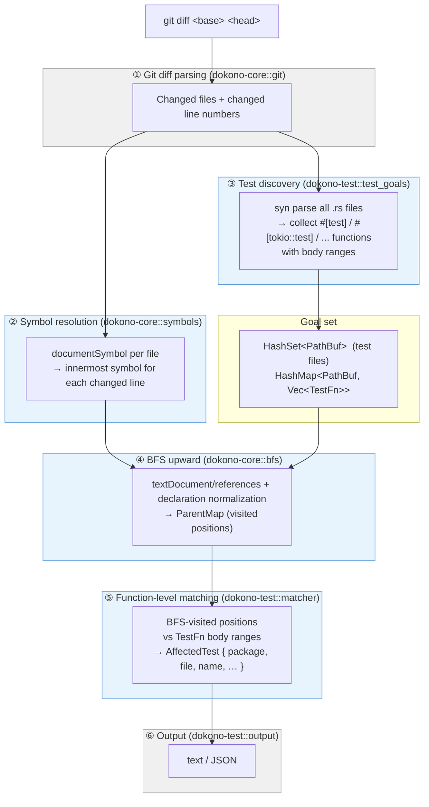

# dokono-test

[](#license)

A CLI tool that detects **which test functions are affected by a code change** in a Rust workspace, without running a build. It uses [rust-analyzer](https://rust-analyzer.github.io/) over LSP to trace symbol-level reference graphs and [syn](https://crates.io/crates/syn) to statically discover test functions.

`dokono-test` is the sibling of [dokono-rs](../dokono-rs/) — where `dokono-rs` answers "which binary entrypoints are affected?", `dokono-test` answers "which test functions are affected?". Both share the same analysis machinery via the internal [`dokono-core`](../dokono-core/) library.

> The name continues the *dokono* (どこの) theme — "from where" — now asking "which test does this change come from?".

---

Contents:

- [Motivation](#motivation)
- [How it works](#how-it-works)
- [Installation](#installation)
- [Usage](#usage)
  - [Inspect the impact of a PR](#inspect-the-impact-of-a-pr)
  - [Compare two arbitrary git refs](#compare-two-arbitrary-git-refs)
  - [Output formats](#output-formats)
  - [Diagnostic mode (debug subcommands)](#diagnostic-mode-debug-subcommands)
- [Test attribute detection](#test-attribute-detection)
- [Supported project layouts](#supported-project-layouts)
- [Requirements](#requirements)
- [Known limitations](#known-limitations)
- [Troubleshooting](#troubleshooting)
- [License](#license)

## Motivation

In a Rust workspace, `cargo test` runs every test by default. As a monorepo grows to hundreds or thousands of tests, full test suites become the bottleneck in CI and developer feedback loops.

Cargo's dependency graph resolves at the **crate level**. If you change a single function in a shared `domain` crate, Cargo re-runs every test in every crate that depends on `domain` — even though only a handful of tests might actually call the changed function.

`dokono-test` solves this by walking the reference graph at the **symbol level** through rust-analyzer's LSP interface and mapping BFS-reached positions back to individual test functions discovered by `syn`.

On a workspace with 800+ tests, a typical PR might affect only 3–5 tests. `dokono-test` identifies exactly those, cutting the test execution surface by over 99%.

## How it works



Key details:

- **Test discovery (③)** uses `syn` to parse every `.rs` file in the workspace (excluding `target/` and `.git/`). No build or macro expansion is involved, so collection completes in 1–3 seconds even on large workspaces.
- **BFS (④)** reuses `dokono-core::bfs::run_with_parents` unchanged. The goal set is the set of files that contain at least one test function. As BFS traverses `textDocument/references` upward through call chains, it records every visited position in a `ParentMap`.
- **Function-level matching (⑤)** checks whether any BFS-visited position (from `starts`, `parents`, or `entry_hits`) falls inside a test function's `body_range`. This narrows the result from "this test file was reached" to "this specific test function was reached."
- **Direct edit detection**: if a change site itself sits inside a test function's body (e.g., you edited a `#[test]` function directly), that test is included immediately from the `starts` set — no BFS traversal required.
- **Trait dispatch** through `Arc<dyn Trait>` is captured by normalizing impl methods to trait method declarations via `textDocument/declaration`, inherited from `dokono-core`.

## Installation

Build from source (published to crates.io alongside `dokono-rs`):

```bash
cargo install dokono-test
```

Or build from the repository:

```bash
git clone https://github.com/enomoto11/dokono-rs
cd dokono-rs
cargo build --release -p dokono-test
# binary is produced at ./target/release/dokono-test
```

`rust-analyzer` must be available on `$PATH`:

```bash
rustup component add rust-analyzer
```

## Usage

### Inspect the impact of a PR

Pass a GitHub PR number and `dokono-test` will fetch the head from `origin`, compute the merge-base against `--base`, and run the analysis.

```bash
# Impact of PR #42 against the master branch
dokono-test --workspace /path/to/your-workspace --pr 42

# Compare against a release branch instead
dokono-test --workspace /path/to/your-workspace --pr 42 --base release
```

`--base` defaults to `master`.

Internally this runs:

```bash
git fetch origin pull/<N>/head:dokono-test-pr-<N>
git merge-base <base> dokono-test-pr-<N>
# diff is taken between that merge-base and dokono-test-pr-<N>
```

**Assumptions for `--pr`:**

- The target workspace's `origin` remote points at the GitHub repository that owns the PR.
- The remote uses GitHub's `pull/<N>/head` ref convention. Other forges are not supported by `--pr`.
- The remote name is `origin`.

If any of those assumptions do not hold, use `--head/--base` instead:

```bash
git fetch upstream pull/123/head:my-pr
dokono-test --workspace . --base $(git merge-base master my-pr) --head my-pr
```

### Compare two arbitrary git refs

Without `--pr`, compare any two git refs directly:

```bash
# Base branch vs current HEAD
dokono-test --workspace /path/to/your-workspace --base master --head HEAD

# Two specific commits
dokono-test --workspace /path/to/your-workspace --base abc123 --head def456

# Your feature branch vs master
dokono-test --workspace /path/to/your-workspace --head my-feature-branch
# (--base defaults to master)
```

`--head` and `--pr` are mutually exclusive — pass exactly one.

### Output formats

Two output formats are supported, selected with `--format` (default: `text`).

#### `--format text` (human-friendly)

```
Affected tests: (3 functions)
  my-domain :: test_user_validation (my-domain/src/model/user.rs:42)
  my-app :: test_order_create (my-app/src/usecase/order.rs:118)
  my-api :: test_controller_health (my-api/src/controller/health.rs:67)
```

- Each line shows `package :: test_name (file:line)`.
- Paths are relative to the workspace root.
- Order is deterministic (sorted via `BTreeSet`).
- When nothing is affected: `Affected tests: none`.

Progress is printed on **stderr** (one line per phase), so **stdout never contains progress noise** and is safe to parse.

#### `--format json` (CI / scripting)

A single JSON object on **stdout**, silent on **stderr** (apart from hard errors). Suitable for piping into `jq`:

```bash
dokono-test --workspace . --pr 42 --format json
```

```json
{
  "pr": 42,
  "base": "abc123def456...",
  "head": "dokono-test-pr-42",
  "affected_tests": [
    {
      "package": "my-domain",
      "file": "my-domain/src/model/user.rs",
      "name": "test_user_validation",
      "module_path": "my_domain::model::user::tests::test_user_validation",
      "line": 42
    }
  ],
  "stats": {
    "total_tests": 847,
    "affected_tests": 3
  }
}
```

| Field | Type | Notes |
|---|---|---|
| `pr` | int \| null | PR number when invoked with `--pr`, otherwise `null`. |
| `base` / `head` | string | Git refs as resolved by `dokono-test`. |
| `affected_tests` | array | Each entry has `package`, `file`, `name`, `module_path`, `line`. Sorted by `module_path`. Empty when no `.rs` files changed or no symbol-level change was detected. |
| `stats.total_tests` | int | Total test functions found by `syn` parse across the workspace. |
| `stats.affected_tests` | int | Number of tests in `affected_tests`. |

Example CI snippets:

```bash
# Run only the affected tests with cargo test, grouped by package
dokono-test --workspace . --pr "$PR" --format json \
  | jq -r '.affected_tests | group_by(.package)[] |
           "cargo test -p \(.[0].package) -- " + ([.[].module_path] | join(" "))' \
  | bash

# Same idea with cargo nextest
dokono-test --workspace . --pr "$PR" --format json \
  | jq -r '.affected_tests[] | "-E \"test(\(.module_path))\""' \
  | xargs cargo nextest run

# Fail if a specific test is impacted
affected=$(dokono-test --workspace . --pr "$PR" --format json | jq -r '.affected_tests[].name')
echo "$affected" | grep -q 'critical_test' && exit 1 || exit 0
```

Exit code is `0` on success (including an empty `affected_tests` list), non-zero on error.

`dokono-test` deliberately stops at producing the test list; the choice of runner (`cargo test`, `cargo nextest`, etc.) and any retry / parallelism policy is left to the caller.

### Diagnostic mode (debug subcommands)

For inspecting individual pipeline stages, use the `debug` subcommand:

```bash
# List every test function discovered by syn parsing
dokono-test debug print-tests --workspace /path/to/your-workspace

# Parsed git diff (file, changed line numbers)
dokono-test debug print-diff --workspace /path/to/your-workspace --base master --head HEAD

# BFS starting symbols derived from the git diff via LSP
dokono-test debug print-starts --workspace /path/to/your-workspace --base master --head HEAD
```

`print-tests` output format (tab-separated):

```
my-domain/src/model/user.rs	test_user_validation	Test	42:58
my-app/src/usecase/order.rs	test_order_create	TokioTest	118:145
```

Columns: `file`, `name`, `attribute_type`, `body_range_start:body_range_end`.

Logging is powered by the [`tracing`](https://crates.io/crates/tracing) crate and controlled via `RUST_LOG`:

```bash
# Show BFS traversal and matcher details
RUST_LOG=dokono=debug dokono-test --workspace /path/to/your-workspace --pr 42

# Suppress all log output (e.g. for CI)
RUST_LOG=off dokono-test --workspace /path/to/your-workspace --pr 42
```

## Test attribute detection

`dokono-test` discovers test functions by statically parsing Rust source files with `syn`. The following attributes are recognized by matching the last path segment of each attribute:

| Attribute | Variant | Notes |
|---|---|---|
| `#[test]` | `Test` | Standard library test attribute. |
| `#[tokio::test]` | `TokioTest` | Also matches `#[::tokio::test]` and `#[tokio::test(flavor = "...")]`. |
| `#[async_std::test]` | `AsyncStdTest` | Also matches `#[::async_std::test]`. |
| `#[rstest]` | `Rstest` | Parameterized test framework. |
| `#[test_case(...)]` | `TestCase` | Also matches `#[test_case::test_case(...)]`. |

Detection is based on the attribute path's final segment (e.g., `test`, `rstest`, `test_case`), with additional path inspection to distinguish `tokio::test` from a bare `test`. This accepts both short and fully-qualified forms (`#[tokio::test]` and `#[::tokio::test]`).

**What is intentionally not detected:**

- Proc-macro-generated test functions (e.g., `sqlx::test`, `proptest!` macro bodies). These require macro expansion, which `syn` cannot perform. See [Known limitations](#known-limitations).
- Helper functions inside `#[cfg(test)] mod tests { }` blocks. These are not test functions themselves, but BFS will still trace through them to reach the calling test function.

## Supported project layouts

Test functions are discovered by `syn` parsing every `.rs` file, so any layout works regardless of `Cargo.toml` declarations:

```
src/lib.rs                  # unit tests inside #[cfg(test)] mod tests {}
src/bin/a.rs                # tests in binary crates
src/model/foo.rs            # tests in submodules
tests/integration.rs        # integration tests
tests/support/mod.rs        # test helpers (discovered but not counted as test goals)
crates/foo/src/lib.rs       # workspace member
```

Package names are resolved via `cargo metadata` (using `PackageMap`), which maps each source file to its owning package. They appear in both the text output (`<package> :: <test_name>`) and the JSON `package` field so callers can group tests for `cargo test -p <package>` or `cargo nextest --partition <...>`.

## Requirements

| | |
|---|---|
| Rust toolchain | stable (required to build) |
| rust-analyzer | must be on `$PATH` (install with `rustup component add rust-analyzer`) |
| Git | any version |
| Target workspace | `cargo metadata` must succeed (i.e., a valid `Cargo.toml`). The code does not need to compile, but dependencies must resolve for rust-analyzer indexing. |

## Known limitations

### Inherited from dokono-rs

- **Macro expansion**: heavy proc-macro / declarative-macro usage can leave rust-analyzer's reference resolution incomplete.
- **External crates**: rust-analyzer's `SearchScope` is limited to the local workspace.
- **Generic / inference-dependent code**: rust-analyzer may not return references where it cannot infer a type.
- **Downward traversal of trait impls**: BFS walks *upward* (caller-side) and does not enumerate all impls of a trait.

### Specific to dokono-test

- **Proc-macro-generated tests**: `syn` parses source code without macro expansion, so tests generated by proc-macros (`sqlx::test`, `proptest!`, etc.) are not detected. This is a deliberate trade-off: avoiding a build keeps the tool fast. A future `--fallback-list` flag could shell out to `cargo test -- --list` to supplement.
- **`#[cfg]` gating**: tests gated behind `#[cfg(feature = "...")]` are discovered regardless of whether the feature is enabled. This can produce false positives (safe direction — extra tests are run, but none are missed).
- **`#[ignore]` tests**: included in the affected set. The caller can filter them out in CI using `cargo test` flags (`--include-ignored` or not).
- **Inline module tracking**: `syn` tracks inline `mod { ... }` nesting (e.g., `mod tests { ... }`) for constructing the `module_path`, but does not follow external `mod foo;` declarations — those live in separate files and contribute to the path via `file` instead.

## Troubleshooting

### Empty result (`Affected tests: none`)

Possible causes:

1. The changed lines fall outside any symbol (comments, `use` statements, blank lines) — BFS has no starting point.
2. No test functions were found — run `dokono-test debug print-tests` to verify detection.
3. The PR fetch failed — look for `git fetch origin pull/<N>/head:...` errors on stderr.
4. rust-analyzer indexing was incomplete — set `RUST_LOG=dokono=debug` and check that `experimental/serverStatus quiescent=Some(true)` is observed.

### Fewer tests detected than expected

- Tests generated by proc-macros are invisible to `syn`. Use `dokono-test debug print-tests` to see what was detected, and compare with `rg '#\[test\]' --type rust -c` for `#[test]` counts or `rg '#\[tokio::test\]' --type rust -c` for tokio tests.
- Files under `target/` and `.git/` are excluded from the scan. If tests live in unusual directories, ensure they are not being filtered.

### `Unknown binary 'rust-analyzer' in official toolchain '...'`

The target workspace's `rust-toolchain.toml` pins a toolchain without rust-analyzer:

```bash
rustup component add rust-analyzer --toolchain <the project's toolchain>
```

Or override for one invocation:

```bash
RUSTUP_TOOLCHAIN=stable dokono-test --pr 42 ...
```

### Module responsibilities

**`test_goals`** — Walks the workspace with `walkdir`, parses every `.rs` file with `syn`, and uses a `syn::visit::Visit` impl to collect functions marked with known test attributes. Returns `Vec<TestFn>` where each entry carries the file path, function name, 1-based body range, attribute type, and inline module path.

**`matcher`** — Takes the BFS result (`ParentMap` + `entry_hits`) from `dokono-core` and the test function index from `test_goals`. Checks whether any BFS-visited position falls inside a test function's `body_range`. Constructs `AffectedTest` entries with package name, file path, test name, module path, and line number. Uses `PackageMap` (loaded from `cargo metadata`) to map files to package names.

**`output`** — Formats the affected test set for display. Two modes:
- `text`: human-readable one-per-line format to stdout.
- `json`: a structured JSON object with `stats` (total, affected, reduction percentage) for CI consumption.

## License

[MIT License](../../LICENSE)
